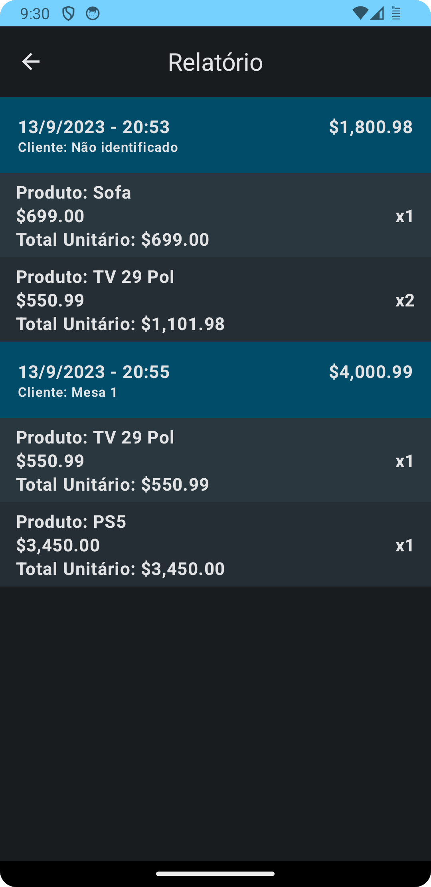

# Omie PDV

Código para a processo seletivo da empresa Omie.

O aplicativo simula um ponto de venda com a possibilidade de adicionar produtos, realizar vendas, consultar o valor total das vendas, além de uma visualização do historico de vendas.

Os dados gerados são armazenados no armazenamento local do dispositivo e consultados conforme o fluxo de aplicativo.

## Stack utilizada

- Kotlin + Flow - 1.8.10
- Compose - 1.4.3
- Hilt
- Mockk
- Turbine

## Funcionalidades

- Consultar valor total das vendas
- Adicionar produtos
- Realizar venda
  - Cada venda possui um ou mais produtos
  - Cada produto pode ter um ou mais quantidade
- Histórico de vendas


## Arquitetura proposta

A arquitetura do aplicativo está sendo representada pelo seguinte esquema: 


Arquitetura detalhada


## Screenshots

| Home                                                        | New Product                                                        | New Sale                                                        | Checkout                                                        | History                                                        |
|-------------------------------------------------------------|:-------------------------------------------------------------------|:----------------------------------------------------------------|:----------------------------------------------------------------|----------------------------------------------------------------|
|  |  |  |  |  |

Um video foi gravado para demonstração e encontra-se na pasta `readme-content`. Essa pasta contém inclusive os screenshoots.

## Instalação

Para executar o projeto execute os seguintes comandos na pasta root do aplicativo:

```bash
    ./gradlew build
    ./gradlew assembleDebug
    ./gradlew installDebug
```

Para verificar os testes unitários execute o seguinte comando:

```bash
    ./gradlew test
```
## Desenvolvedor

Gustavo Soares de Oliveira
Linkedin: [https://www.linkedin.com/in/oliveiragustavos/](https://www.linkedin.com/in/oliveiragustavos/)
Contato: (31)99976-3087
